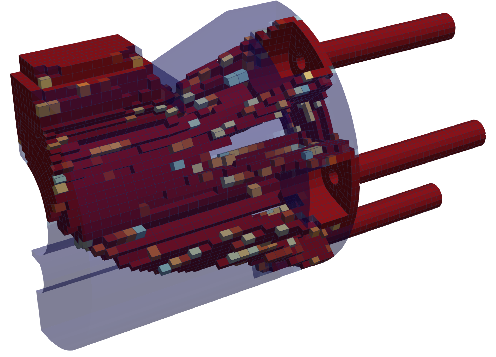

# EasySIMP.jl

EasySIMP is a Julia package for topology optimization using the Solid Isotropic Material with Penalization (SIMP) method, based on [Sigmund (2001)](https://doi.org/10.1007/s001580050176). It provides an intuitive interface suitable for educational purposes and practical applications. For usage examples, see [`test/Examples/`](test/Examples/).

<p align="center">
  
</p>

## Features

- **SIMP Optimization**: Classic topology optimization with penalization parameter control and density filtering
- **Mesh Support**: Linear hexahedral and tetrahedral elements; supports VTU import and simple hexahedral mesh generation
- **Boundary Conditions**: Fixed supports, sliding planes, distributed forces, and body forces
- **Progress Monitoring**: Real-time optimization progress with compliance and volume tracking
- **ParaView Export**: VTU output with density field, displacement, and stress

## Installation

```julia
# From Julia REPL, press ] to enter package mode
pkg> add https://github.com/jezekon/EasySIMP.jl
```

or

```bash
git clone https://github.com/jezekon/EasySIMP.jl
```

## Main Function

Run SIMP topology optimization:

```julia
simp_optimize(grid, dh, cellvalues, forces, boundary_conditions, params, acceleration_data)
```

#### Parameters:
- `grid::Grid`: Ferrite Grid object containing the mesh
- `dh::DofHandler`: Degree of freedom handler from Ferrite
- `cellvalues`: CellValues for finite element integration
- `forces`: Vector of tuples `(dh, node_indices, force_vector)` for applied forces
- `boundary_conditions`: Vector of constraint handlers (fixed or sliding)
- `params::OptimizationParameters`: Configuration options
- `acceleration_data`: Optional tuple `(acceleration_vector, base_density)` for body forces

#### Return Value:
- `OptimizationResult`: Complete optimization results including densities, displacements, stresses, and convergence history
- **Output files**: `.vtu` mesh files for visualization in ParaView

### OptimizationParameters

Configure the optimization process with the following options:

```julia
params = OptimizationParameters(;
    E0 = 1.0,                              # Young's modulus of solid material
    Emin = 1e-9,                           # Young's modulus of void (numerical stability)
    ν = 0.3,                               # Poisson's ratio
    p = 3.0,                               # SIMP penalization parameter
    volume_fraction = 0.5,                 # Target volume fraction (0-1)
    max_iterations = 200,                  # Maximum optimization iterations
    tolerance = 0.01,                      # Convergence tolerance
    filter_radius = 1.5,                   # Density filter radius (× element size)
    move_limit = 0.2,                      # Maximum density change per iteration
    damping = 0.5,                         # Optimality criteria damping factor
    use_cache = true,                      # Enable performance caching
    export_interval = 0,                   # Export every N iterations (0 = disabled)
    export_path = ""                       # Path for intermediate results
)
```

#### Option Details

- **E0**: Young's modulus of the solid material (typically 1.0 for normalized, or actual values like 200 GPa for steel)
- **Emin**: Minimum stiffness to avoid singularity (recommended: 1e-6 to 1e-9)
- **ν**: Poisson's ratio of the material
- **p**: SIMP penalization parameter (typically 3.0)
- **volume_fraction**: Target volume constraint as fraction of total volume
- **filter_radius**: Controls smoothing of density field (1.5-2.5 × average element size recommended)
- **export_interval**: When > 0, exports intermediate results every N iterations for animation
- **use_cache**: Enables caching of element stiffness matrices for improved performance

### Example Usage

```julia
using EasySIMP
using Ferrite

# 1. Generate or import mesh
grid = generate_grid(Hexahedron, (60, 20, 4), 
                     Vec((0.0, 0.0, 0.0)), 
                     Vec((60.0, 20.0, 4.0)))

# 2. Setup FEM problem
dh, cellvalues, K, f = setup_problem(grid)

# 3. Define boundary conditions
fixed_nodes = select_nodes_by_plane(grid, [0.0, 0.0, 0.0], [1.0, 0.0, 0.0], 1e-3)
force_nodes = select_nodes_by_circle(grid, [60.0, 0.0, 2.0], [1.0, 0.0, 0.0], 1.0)

# 4. Apply boundary conditions
material_model = create_simp_material_model(200.0, 0.3, 1e-6, 3.0)
assemble_stiffness_matrix_simp!(K, f, dh, cellvalues, material_model, 
                                fill(0.4, getncells(grid)))
ch_fixed = apply_fixed_boundary!(K, f, dh, fixed_nodes)

# 5. Configure optimization
opt_params = OptimizationParameters(
    E0 = 200.0,
    volume_fraction = 0.4,
    max_iterations = 100,
    filter_radius = 2.5,
    export_interval = 5,
    export_path = "./results"
)

# 6. Run optimization
results = simp_optimize(
    grid, dh, cellvalues,
    [(dh, collect(force_nodes), [0.0, -1.0, 0.0])],
    [ch_fixed],
    opt_params
)

# 7. Export results
results_data = create_results_data(grid, dh, results)
export_results_vtu(results_data, "cantilever_beam")
```

### Advanced Usage Examples

For complete examples with detailed documentation, see [`test/Examples/`](test/Examples/):

#### Basic Examples
```julia
# Simple cantilever beam with fixed support
julia --project=. test/Examples/01_basic_cantilever.jl

# Beam with sliding (symmetry) boundary condition
julia --project=. test/Examples/02_sliding_support.jl

# Beam under acceleration (body forces)
julia --project=. test/Examples/03_with_acceleration.jl
```

#### Complex Example
```julia
# Multi-objective gripper with imported mesh
# Features: multiple loads, symmetry, body forces
julia --project=. test/Examples/04_gripper_complex.jl
```

### Visualization in ParaView
1. Load the output VTU file in ParaView
2. Apply **Clip with implicit function**
3. Clip Type: `density` to show solid regions (adjust Value and select Invert if needed)

For intermediate results animation:
1. Load all `iter_*.vtu` files as a time series
2. Animate to see optimization convergence

___
## Acknowledgments
This package implements the classic SIMP method for topology optimization. The implementation is inspired by the educational paper "A 99 line topology optimization code written in Matlab" by Sigmund (2001) and its extensions.
